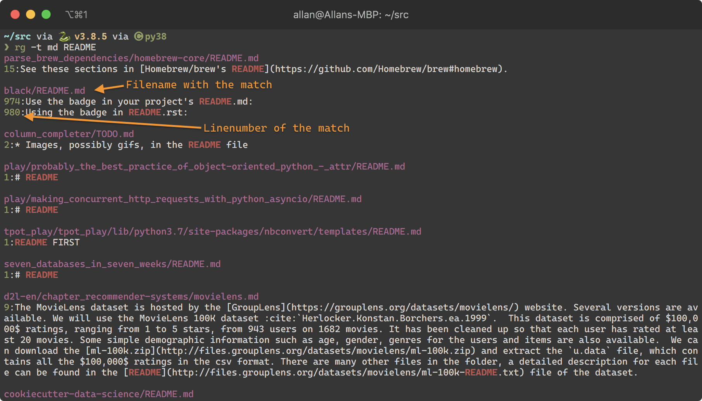
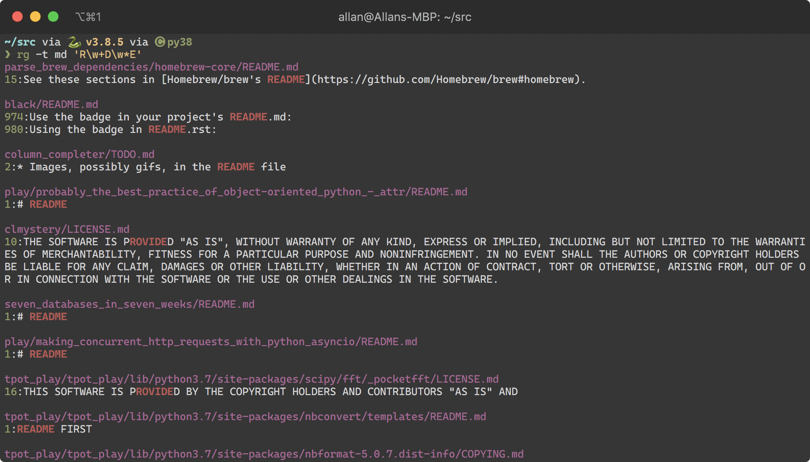
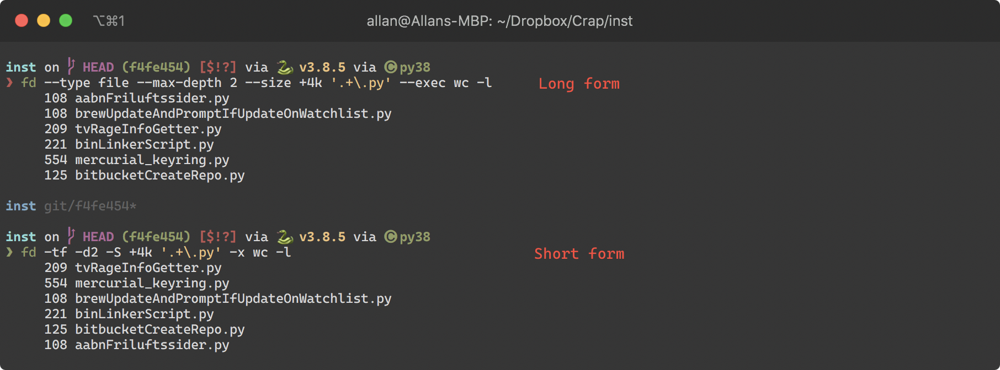
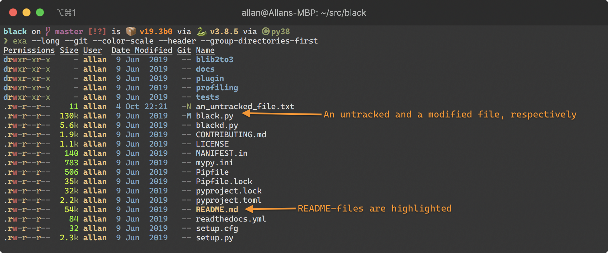
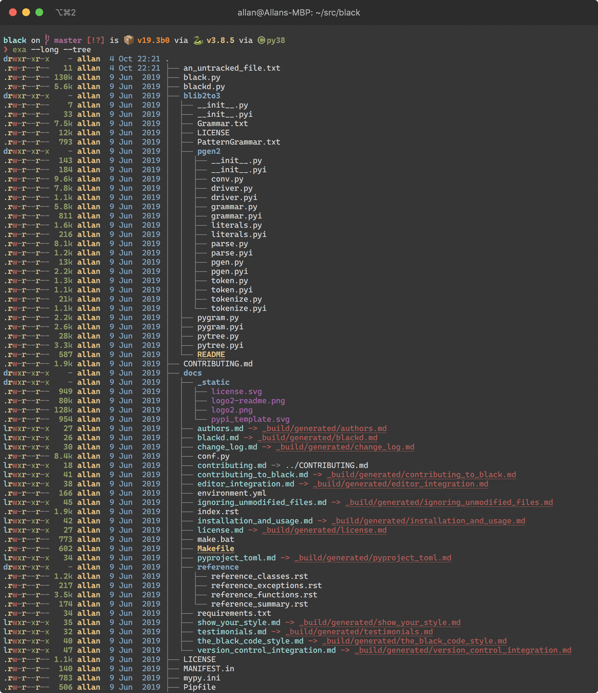
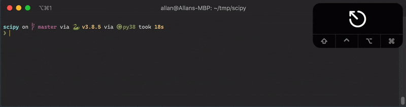
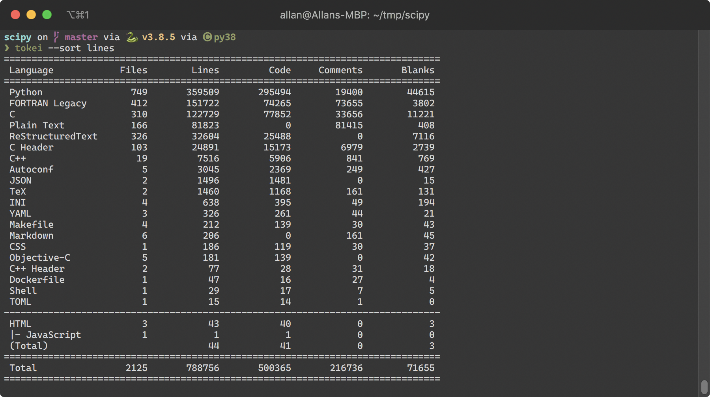

# Commandline tools of a modern age

I have been using commandline tools for years, but in the past few I have grown increasingly accustomed to a new "generation" of commandline tools.
They differentiate themself by being optimized for ease of use and present information in a human-friendly manner, rather than offering a plethora of options.


## The tools

I'm using [Zsh](https://www.zsh.org/) as my shell, and currently also using [Oh-my-Zsh](https://github.com/ohmyzsh/ohmyzsh) (though I'm considering going with a more lightweight solution).

Now let's have a look at the tools, shall we?


### [Ripgrep](https://github.com/BurntSushi/ripgrep#ripgrep-rg) (`rg`, implenented in Rust)

_Fast `grep`-like, Git-aware code-search with colorized output._

Albeit it's name suggest it's a replacement for `grep` (which it is), I'd argue that it's a replacement for [`ack`](https://beyondgrep.com/).
It's a tool intended for performing blazing fast searches of your code, but unlike `grep`, it respects the patterns defined in your _.gitignore_ file, and it doesn't search your _.git_-directory either.

Ripgrep also knows about filetypes (which can have multiple file-extensions).
To search for all markdown-files containing the string _README_, we could simply run:

```
❯ rg -t md README
```



But what file extensions are included in the markdown filter?
Let's check:
```
❯ rg --type-list | grep -P "^md"
md: *.markdown, *.md, *.mdown, *.mkdn
```

It's also worth noticing that Ripgrep uses regular expressions by default


It's a tool I use all the time, and I highlight recommend checking it out.
The Github page gives a nice overview of it's capabilities.

Oh, and it works on Windows too!


### [`fd`](https://github.com/sharkdp/fd#fd) (implemented in Rust)

_Fast Git-aware file searching with colorized output._

`fd` is for `find` what Ripgrep is for grep: It searches filenames and respects your _.gitignore_ patterns.
But unlike the `find`-command, the options are easy to remember… Suppose we want to find all
* _files_
* which is at most two directories below our working directory,
* and is greater than 4 kB,
* whose name ends with _.py_ (notice that it's expressed as a regex)
* and count the number of lines in those files by invoking the command `wc -l` on each file.



While the long form might seem a bit slow, I find the options very easy to memorize, and in terms of speed, that beat looking them up.
But you could of course memorize the short-hand version of the one you use the most.

If you find yourself googling the commandline options for the `find`-command, you should give `fd` a chance.
Lastly, have a look at this gif from the README, which beautifully demonstrates `fd`:


Oh, and it works on Windows too!


### [`exa`](https://the.exa.website/https://the.exa.website/) (implemented in Rust)

_A Git-aware `ls` replacement with clever utilization of color._

Exa aims to replace `ls`, and have long been my daily driver, using a few aliases for listing files and files including hidden files respectively:

```
l='exa --long --git --ignore-glob "._*" --color-scale --header --group-directories-first'
la='exa --all --long --git --ignore-glob "._*" --color-scale --header --group-directories-first'
```



I like how it's use of color enables me to quickly scan the screen to find the information I'm looking for, be it file-permissions or file-size.
Using the tool, I get the feeling that the use of color is a carefully applied in order to convey the information on the screen to the user the most convenient way possible.

The capabilities of exa goes a bit beyond that of `ls`, as it can also draw the file-trees:



### [`fzf`](https://github.com/junegunn/fzf)

_Fuzzy-filtering of streams of text._

`fzf` is a fuzzy-finder for the commandline.
Think of it as an interactive version of `grep`, where you don't have to spell the string which you're searching for 100 % correctly... you can miss some characters here and there, and `fzf` will still include your desired result in the filtered list.

By itself `fzf` isn't that useful, but it elevates the interactiveness and user experience a lot of other commandline tools.

Below is an example where I use `fzf` to filter my command history — see the [`fzf` Github Wiki](https://github.com/junegunn/fzf/wiki) for setup instructions:
 


### [`tokei`](https://github.com/XAMPPRocky/tokei) (implemented in Rust)

_Git-aware statistics for code._

Count number of lines, filetypes comments... useful when you encounter a new codebase, and quickly need to gain an overview of the code.




### [Starship](https://starship.rs/) (implemented in Rust)

_Shell prompt rich on information._

You might have noticed that I have a lot of information in my prompt; it's provided by the program Starship.
Starship supports Bash, Fish, Zsh and Powershell.

While you can configure Starship your particular needs, I've found the standard settings quite useful, and never bothered configuring it.


